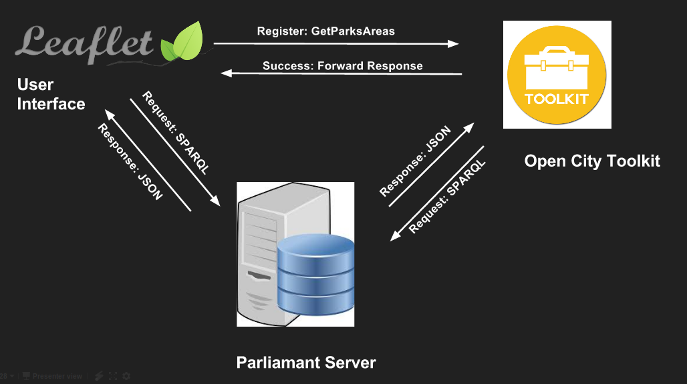
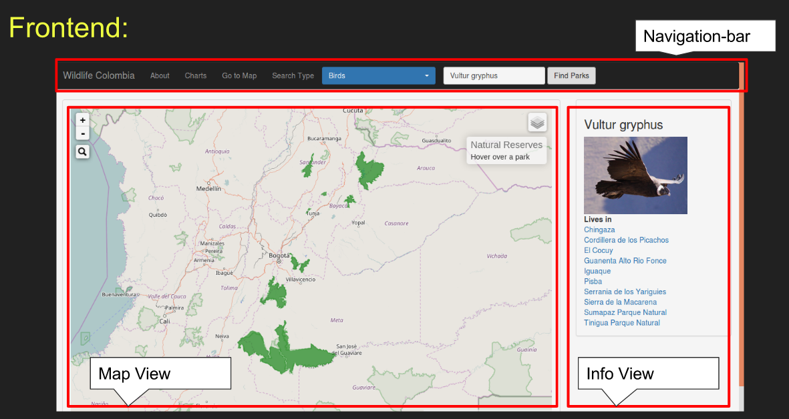
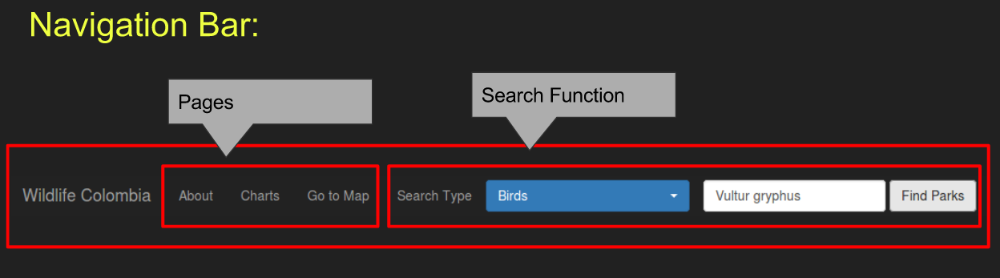
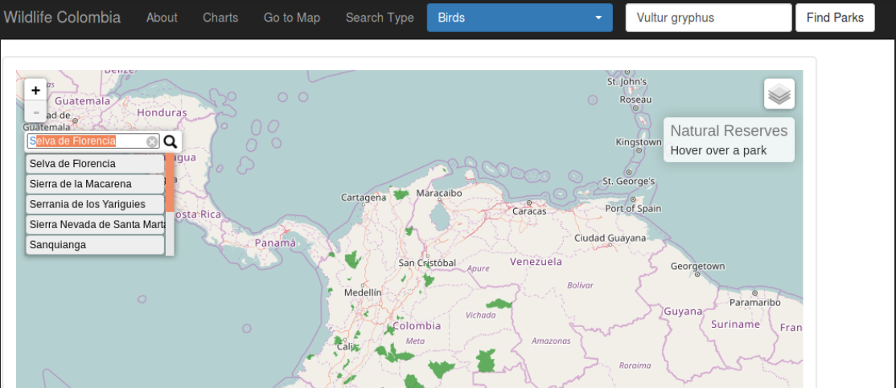
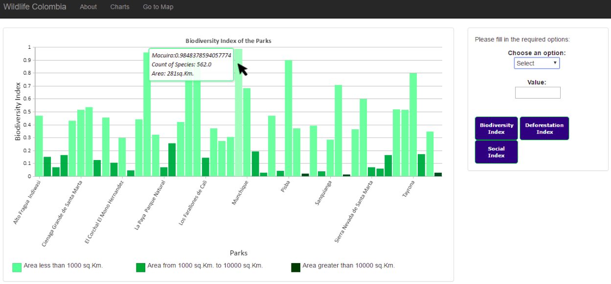
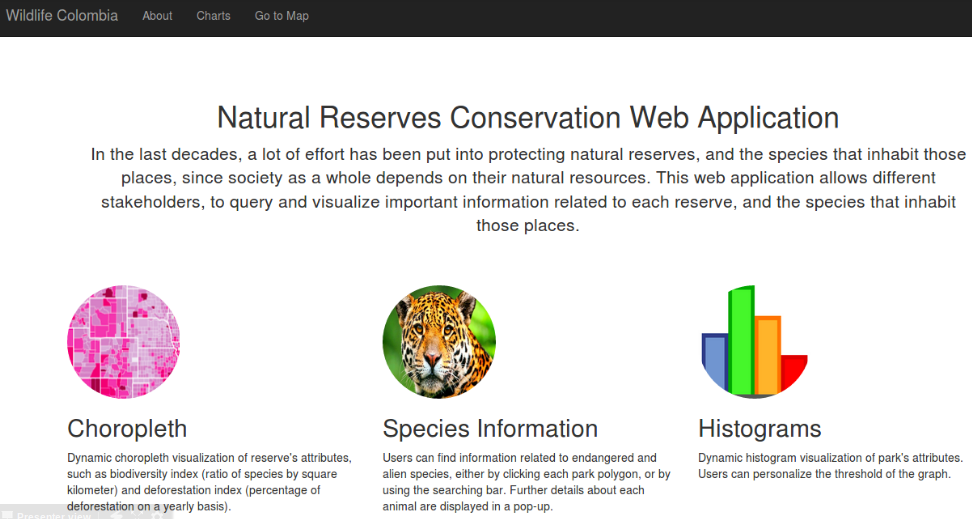

# GIIS-MapApp

## About
> Study project in winter term 2016/17 at ifgi for coursework GI in Society

The goal of this study project was to built a Web application for Conservation of Natuaral Reserves in Columbia. It helps in answering following questions

1. Helping Tourists in finding a location which is safe to visit and has particular specie type.
2. Help researchers to find habitat of a particular specie and in which park they can be found.
3. Help researchers to understand the spatial distribution of specie and recommend conservation strategies.
4. Help policy makers to set conservation priorities based on information like deforestation index.

## Summary
Visualizing the conservation status of natural reserves and its endangered species for Columbia. Open Data was collected from multi-institutinal websites and converted into Open Linked Data (RDF triples). A web application was then developed using Leaflet and external plug-ins.

## Technologies

* [Leaflet](http://leafletjs.com/)

* [Linked Data](http://linkeddata.org/)

* [CanvasJS](http://canvasjs.com/)

* JQuery & Bootstrap

List of other dependencies can be found in package.json file.

## Architecture

## Functionalities

### Map View

#### Navigation

#### Search-Park

### Statistics

### About

